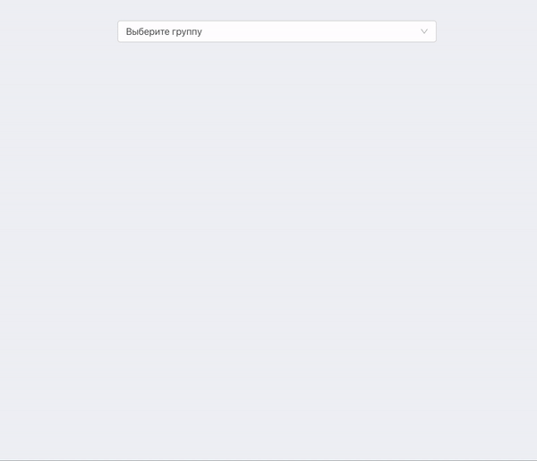
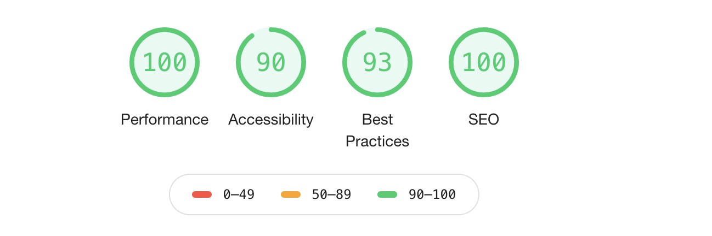

## Решение тестового задания

[Ссылка на описание тестового задания](https://github.com/potapovnikita/job-frontend-developer-test/blob/master/README.md)

## Демо

## Chrome audit (no throttling)

## Запуск

- Запустить бекенд из ссылки на тестовое задание
- В файле src/config.ts указать url бекенда
- npm i
- npm start
